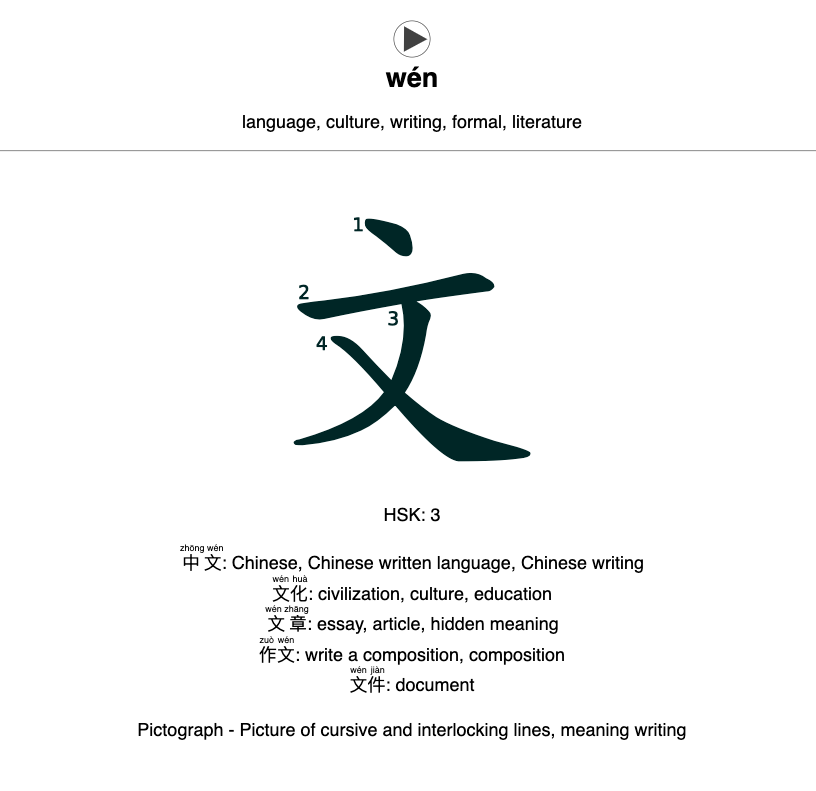

# AnkiChinese

Asynchronously scrape the ArchChinese dictionary to generate [Anki](https://apps.ankiweb.net/) flashcards

  <table class="table">
    <tr>
      <td>
        
      </td>
    </tr>
    <tr>
      <td class="caption">Online Flashcard</td>
    </tr>
  </table>

  <table class="table">
    <tr>
      <td>
        
      </td>
    </tr>
    <tr>
      <td class="caption">Offline Flashcard</td>
    </tr>
  </table>

# Installation

    pip install ankichinese
    playwright install

# Usage

    ankichinese

    -h, --help                          Show help message and exit 

    --export, -x {anki, csv, update}    Export mode (default: anki)
                                        anki: Generate new AnkiChinese deck
                                        csv: Generate CSV file
                                        update: Update existing deck
    --input, -i INPUT                   Input file with characters to scrape (default: input.txt)
    --output, -o OUTPUT                 Name of output file (do not include extension) 
                                        (default: ankichinese_output)

    --definitions, -def NUM             Number of definitions to scrape per character (default: 5)
    --examples, -ex NUM                 Number of example words to scrape per character (default: 5)

    --requests-at-once, -r NUM          Maximum number of requests at once (default: 10)
    --requests-per-second, -rs NUM      Maximum number of requests per second (default: 5)
                                

## Generate New AnkiChinese Deck
How to create an entirely new Anki deck with the name `ankichinese_output.apkg` in the current directory using custom AnkiChinese styling. 

1. Create `input.txt` with the characters you want to scrape.
2. Run `ankichinese -x anki`.
3. Open Anki and import `ankichinese_output.apkg`.

**Updating is Easy!**  
Just run `ankichinese -x anki` again with new characters in `input.txt` and import the new `ankichinese_output.apkg` file into Anki. Anki will automatically update the existing deck without losing progress.

## Update Existing (Non-AnkiChinese) Deck Without Losing Progress

1. Create `input.txt` with the characters you want to scrape (can be the same as the existing deck).
2. Run `ankichinese -x update`.
3. Choose deck and model of cards to update. AnkiChinese will search for and overwrite any fields with the same names as the following. 

| Field Name | Description |
| --- | --- |
| Hanzi | Simplified character (**REQUIRED**) |
| Traditional | Traditional form |
| Definition | Meaning of character |
| Pinyin | Most common pinyin |
| Pinyin 2 | Other possible pinyin |
| Words | Example words |
| Formation | Origin / mnemonic for character |
| HSK | Hanyu Shuiping Kaoshi level |
| Audio | Audio file name (**required for audio**) |

4. Import the new `ankichinese_audio.apkg` file into Anki. This will import the audio files (and create an empty deck that can be deleted)

# Tools Used
- Asynchronous I/O: [Asyncio](https://docs.python.org/3/library/asyncio.html)
- Limit concurrency: [Aiometer](https://github.com/florimondmanca/aiometer)
- Web automation and HTML interaction: [Playwright](https://playwright.dev/python/)
- Anki deck generation: [Genanki](https://github.com/kerrickstaley/genanki)
- Anki database access: [AnkiPandas](https://github.com/klieret/AnkiPandas)
- Progress bars: [tqdm](https://github.com/tqdm/tqdm)
- HTML parsing and scraping: [Beautiful Soup](https://www.crummy.com/software/BeautifulSoup/)
- Data manipulation: [Pandas](https://pandas.pydata.org/)

# Credits
Character information: [ArchChinese](https://www.archchinese.com/)

Stroke order diagrams:
- Online stroke order diagrams: [Hanzi Writer](https://hanziwriter.org/)
- Offline stroke order font: [Reinaert Albrecht](https://rtega.be/chmn/index.php?subpage=68)

Chinese audio:
- Standard tones: [Yoyo Chinese](https://yoyochinese.com/chinese-learning-tools/Mandarin-Chinese-pronunciation-lesson/pinyin-chart-table)
- Neutral tones: [Purple Culture](https://www.purpleculture.net/chinese_pinyin_chart/)
